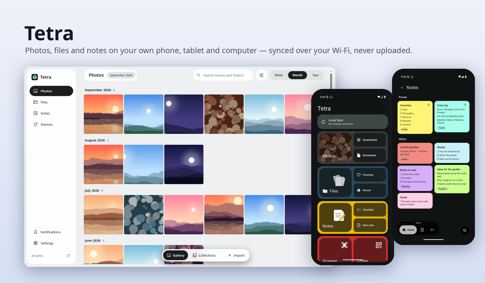
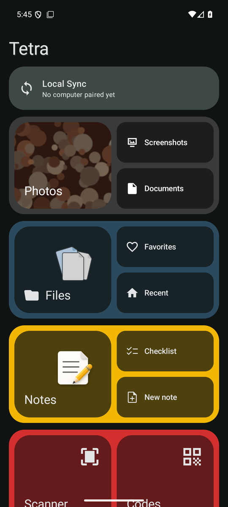
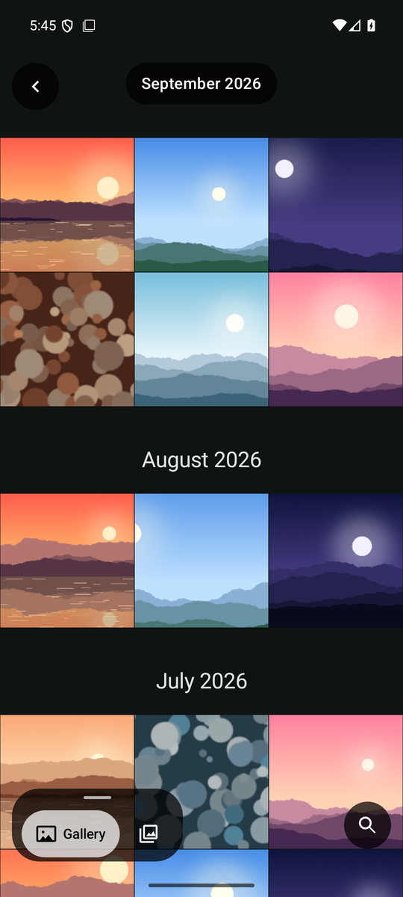
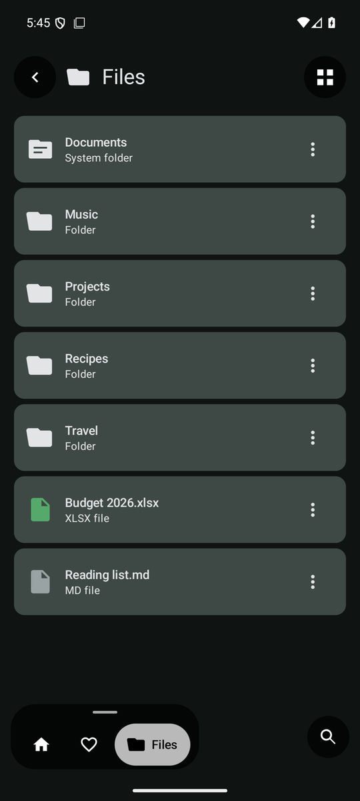
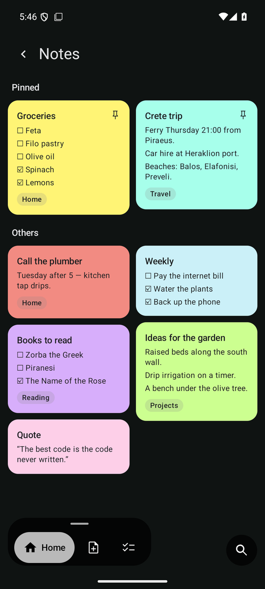

# Tetra for Android



**Your photos, files and notes, kept on your own devices.** Tetra is a gallery, a file manager, a notes app and a
document scanner in one Android app. It pairs with [Tetra for the desktop](https://github.com/kalotrapezis/Drive)
over your own Wi-Fi. Nothing is uploaded anywhere, and every bit of analysis (faces, documents, search labels) runs
on the device.

**Current release: 0.3.0 Beta 1.** It is the first beta: in daily use by its author, but keep your own backups.

<table>
  <tr>
    <td></td>
    <td></td>
    <td></td>
    <td></td>
  </tr>
  <tr align="center"><td>Home</td><td>Photos</td><td>Files</td><td>Notes</td></tr>
</table>

<sub>Screenshots use demo content, not a real library.</sub>

## What it does

| | |
|---|---|
| **Photos** | Your camera photos and videos by week, month or year, with collections, favorites and folder albums. **People** (faces grouped on the phone), **Documents** (receipts and papers found for you), a map, search by place, date or label, an editor, and a **Hidden** vault that is encrypted. It can be the phone's default gallery. |
| **Files** | A file manager for `/sdcard/Tetra`, with search, tags, favorites, folder colours, copy, move, rename and share. Deleting goes to a Trash you can restore from. |
| **Notes** | Text notes and checklists, with colours, labels, pins and a short history of each note. They sync with the desktop. |
| **Scanner** | Scan documents to PDF with automatic cropping, filters, retake and reorder. |
| **Codes** | QR and barcode scanner, text recognition, and copying payment codes. |
| **Sync** | Pair once with the desktop by QR code. Each photo and file is checked by SHA-256 on arrival. Favorites, collections, people, tags and notes travel both ways. Rules per device: send only, both ways, or **Move** (keep a month on the phone, the rest lives on the computer). |

The full, authoritative list is in [FEATURES.md](FEATURES.md).

## Safety rules

- **Nothing is changed without asking.** Editing a photo in place goes through Android's own consent prompt;
  everything else saves a new file.
- **Deleting is always reversible first.** Items go to a Trash, then (on the computer) a purgatory, and only then
  away for good. Emptying the Trash always asks you first.
- **A copy counts only once it is verified.** A photo can leave the phone (Move) only after the computer has
  confirmed it holds the same bytes.
- **Files never leave `/sdcard/Tetra`.** Every path is checked against it.
- Camera, media and location permissions are asked for only where they are used.

## Install

Download the APK from [Releases](https://github.com/kalotrapezis/Drive-Android/releases) (`arm64-v8a` for nearly
every recent phone). Android 11 or newer.

## Build

Requires JDK 17 and the Android SDK (Gradle 8.14 does not run on JDK 25).

```bash
export ANDROID_HOME=~/Android/Sdk
export JAVA_HOME=/usr/lib/jvm/java-17-openjdk-amd64
./gradlew testDebugUnitTest assembleDebug
adb install -r app/build/outputs/apk/debug/app-arm64-v8a-debug.apk
```

Kotlin + Jetpack Compose, min SDK 30, target SDK 36. The package id `com.kalotrapezis.drive` keeps the app's old
name on purpose: changing it would make every existing install a different app.

## Documentation

| File | Purpose |
|---|---|
| [FEATURES.md](FEATURES.md) | What is implemented now, per module |
| [SYNC_PLAN.md](SYNC_PLAN.md) | Sync design and every rule's reason (the same file in both repos) |
| [HANDOFF.md](HANDOFF.md) | Where work stands, newest first |
| [DOCUMENT_SCANNER.md](DOCUMENT_SCANNER.md) | Scanner pipeline and rules |
| [AI_COLLECTIONS_ARCHITECTURE.md](AI_COLLECTIONS_ARCHITECTURE.md) | People and Documents analysis on the device |
| [MANUAL_CHECKLIST.md](MANUAL_CHECKLIST.md) | Acceptance steps on a real device |
| [THIRD_PARTY_NOTICES.md](THIRD_PARTY_NOTICES.md) | Bundled models and library licences |

## Branches

- `main`: releases.
- `alpha`, `bidirectional-sync`: development.
